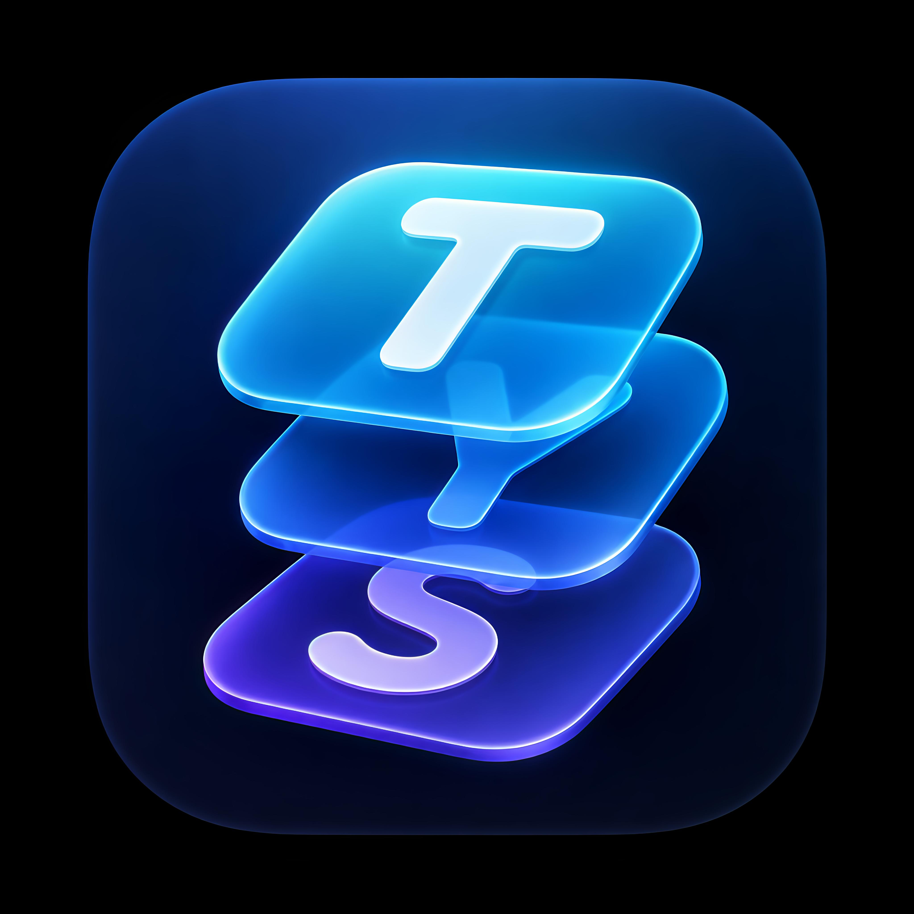

<div align="center">



# TypeShift

**AI-powered text assistant that works in every app across Android, macOS, and Windows**

Type a trigger like `?fix`, `?improve`, or `?formal` anywhere — TypeShift rewrites your text in-place using Groq's blazing-fast LLaMA 3.3 70B model.

[](android/)
[](macos/)
[](windows/)
[](android/)
[](macos/)
[](LICENSE)

</div>

---

## What is TypeShift?

TypeShift is a cross-platform AI writing assistant that hooks directly into the operating system — no copy-paste, no switching apps. It uses the platform's native accessibility API to read and rewrite text in any app you're using.

- **Android** — Accessibility Service runs in the background, detects triggers as you type
- **macOS** — Menu bar app using the macOS Accessibility API (AXUIElement), works in Notes, Mail, VS Code, browsers, and more
- **Windows** — System tray app using a global keyboard hook + clipboard automation, works in every Windows app

All platforms use the [Groq API](https://console.groq.com) (free tier) with `llama-3.3-70b-versatile` for near-instant responses.

### Key features

- ⚡ **19+ built-in commands** — fix grammar, change tone, summarize, translate, and more
- 🛠️ **Custom commands** — users define their own triggers and AI prompts, stored locally
- 🎚️ **Adjustable AI temperature** — slide from precise to creative
- 🔁 **In-place rewriting** — text is replaced directly where you typed it, no copy-paste
- 🌐 **Works everywhere** — browsers, editors, chat apps, email — any text field
- 🌙 **Native dark UI** on every platform

---

## Platform Support

| Platform | Mechanism | Download | Status |
|----------|-----------|----------|--------|
| Android 8+ | `AccessibilityService` | [TypeShift-android.apk](https://github.com/nayalambaliya/TypeShift/releases/latest) | ✅ Live |
| macOS 13+ | `AXUIElement` + `NSMenuBarExtra` | [TypeShift-macOS.zip](https://github.com/nayalambaliya/TypeShift/releases/latest) | ✅ Live |
| Windows 10+ | Global keyboard hook + clipboard | [TypeShift-windows.exe](https://github.com/nayalambaliya/TypeShift/releases/latest) | ✅ Live |

---

## Commands

Type any command at the end of your text, then press **Space** (Android/iOS) or **⌃⇧Space** (macOS). Or use the macOS menu bar to apply a command without typing.

| Command | What it does |
|---------|-------------|
| `?fix` | Fix grammar & spelling |
| `?improve` | Improve clarity and flow |
| `?formal` | Rewrite in professional tone |
| `?casual` | Rewrite in friendly tone |
| `?shorter` | Make it concise |
| `?longer` | Expand with more detail |
| `?reply` | Generate a natural reply |
| `?emoji` | Add relevant emojis |
| `?tldr` | One-sentence summary |
| `?bullet` | Convert to bullet points |
| `?subject` | Generate email subject line |
| `?headline` | Write a catchy headline |
| `?tweet` | Shrink to ≤280 characters |
| `?eli5` | Explain like I'm 5 |
| `?human` | Sound more natural |
| `?hinglish` | Rewrite in Hindi + English mix |
| `?roast` | Funny roast of the text |
| `?translate:XX` | Translate to any language (e.g. `?translate:fr`) |
| `?undo` | Restore the original text |

---

## Tech Stack

### Android
| Layer | Technology |
|-------|-----------|
| Language | Kotlin |
| UI | Jetpack Compose, Material 3 |
| System Hook | `AccessibilityService` + `AccessibilityNodeInfo` |
| Text Replacement | `performAction(ACTION_SET_TEXT)` with clipboard fallback |
| AI | Groq REST API (`OkHttp`) |
| Design | OxygenOS-inspired, AMOLED dark, `#7B61FF` accent |

### macOS
| Layer | Technology |
|-------|-----------|
| Language | Swift |
| UI | SwiftUI + AppKit |
| System Hook | `AXUIElementCreateSystemWide()` + `NSEvent.addGlobalMonitorForEvents` |
| Text Reading | `kAXValueAttribute`, `kAXStringForRangeParameterizedAttribute` |
| Text Writing | `AXUIElementSetAttributeValue`, `CGEvent` (Cmd+A / Cmd+V) |
| Entry Point | `NSMenuBarExtra` (menu bar app, no dock icon) |
| AI | Groq REST API (`URLSession`) |

---

## How It Works

```
User types "Hello world?fix " in any app
         │
         ▼
 ┌──────────────────┐
 │  OS Hook Layer   │  AccessibilityService / AXUIElement / UI Automation
 │  detects trigger │
 └────────┬─────────┘
          │
          ▼
 ┌──────────────────┐
 │  Text Extracted  │  "Hello world"  (trigger stripped)
 └────────┬─────────┘
          │
          ▼
 ┌──────────────────┐
 │  Groq API Call   │  llama-3.3-70b-versatile  (~300ms)
 └────────┬─────────┘
          │
          ▼
 ┌──────────────────┐
 │  In-Place Replace│  "Hello, world!"  written back to the same field
 └──────────────────┘
```

---

## Engineering Highlights

> The interesting part of TypeShift isn't the AI call — it's getting **one product to work natively across three operating systems**, each with a completely different model for reading and writing text in *other* apps.

- **Three native codebases, one product** — Kotlin/Compose (Android), Swift/SwiftUI (macOS), C#/WPF (Windows) — sharing the same command system, design language, and Groq integration.
- **Automated CI/CD** — GitHub Actions builds and publishes **signed Android APKs** and **self-contained Windows executables** to GitHub Releases on every version tag, with the app version injected from the tag.
- **Release code signing** — Android release builds are signed with a keystore stored as encrypted CI secrets, never committed to the repo.
- **Robust text capture** — on macOS, text is read using a three-strategy fallback chain (direct accessibility value → parameterized range query → clipboard) so it works in native apps *and* Electron/browser apps that expose different accessibility APIs.
- **Resilient replacement** — every platform restores the user's original text and clipboard if the AI call fails, so the user never loses what they typed.

---

## Engineering Challenges & What I Learned

Building this taught me as much about **platform constraints and distribution** as about code:

- **Android's accessibility security model** — TypeShift relies on `AccessibilityService`, the most powerful (and most-abused) permission on Android. I learned why Google's Play Protect hard-blocks sideloaded apps that use it (it's a primary vector for banking-trojan malware), and worked through the real distribution tradeoffs: Play Store review with an accessibility declaration vs. re-architecting as a keyboard (IME) to avoid the policy entirely.
- **APK signing & versioning** — debugged a CI signing failure down to a keystore password mismatch, and moved version metadata out of hardcoded values into the release pipeline.
- **Cross-platform accessibility APIs** — each OS exposes text differently; what works in macOS Notes fails in VS Code, which is why the macOS reader has multiple fallbacks.
- **Timing & focus bugs** — browsers update the clipboard slower than native apps, so the macOS/Windows clipboard flows needed carefully tuned delays to stay reliable.

---

## Download

### macOS
1. Go to [**Releases**](https://github.com/nayalambaliya/TypeShift/releases/latest)
2. Download `TypeShift-macOS.zip` and unzip
3. Move `TypeShift.app` to `/Applications`
4. **First launch:** Right-click → Open (bypasses Gatekeeper for unsigned app)
5. Open TypeShift from the menu bar (`T›`) → Settings → enter your free [Groq API key](https://console.groq.com)
6. Go to **System Settings → Privacy & Security → Accessibility** → enable TypeShift

### Android
1. Download `TypeShift-android.apk` from [Releases](https://github.com/nayalambaliya/TypeShift/releases/latest)
2. On your Android phone: **Settings → Apps → Install unknown apps** → allow your browser or Files app
3. Open the downloaded APK and tap Install
4. Open TypeShift → enter your free [Groq API key](https://console.groq.com) → enable the Accessibility Service

> **Note:** Because TypeShift uses Android's Accessibility API (the same powerful permission used by screen readers), Google Play Protect may warn before install. This is expected for any accessibility app distributed outside the Play Store — tap through the prompt to install.

### Windows
1. Download `TypeShift-windows.exe` from [Releases](https://github.com/nayalambaliya/TypeShift/releases/latest)
2. Run it — no installation required, no .NET needed (self-contained)
3. TypeShift appears in your system tray → open Settings → enter your free [Groq API key](https://console.groq.com)

---

## Building from Source

### Prerequisites
- [Groq API key](https://console.groq.com) — free, no credit card required

### Android
```bash
# Clone the repo
git clone https://github.com/nayalambaliya/TypeShift.git
cd TypeShift/android

# Open in Android Studio, or build from CLI:
./gradlew assembleDebug

# Install on connected device:
./gradlew installDebug
```
After install: open TypeShift → enter API key → enable Accessibility Service → enable keyboard in Settings.

### macOS
```bash
git clone https://github.com/nayalambaliya/TypeShift.git
cd TypeShift/macos

# Install xcodegen if needed:
brew install xcodegen

# Generate Xcode project:
xcodegen generate

# Build:
xcodebuild -scheme TypeShiftMac -configuration Release -derivedDataPath build

# Copy to Applications:
cp -R build/Build/Products/Release/TypeShift.app /Applications/
open /Applications/TypeShift.app
```

### Windows
```bash
git clone https://github.com/nayalambaliya/TypeShift.git
cd TypeShift/windows

# Requires .NET 8 SDK (https://dotnet.microsoft.com/download)
dotnet build -c Release
dotnet run
```

---

## License

MIT — see [LICENSE](LICENSE)

---

<div align="center">
  <sub>Built with Swift · Kotlin · C# · Groq API · llama-3.3-70b-versatile</sub>
</div>
